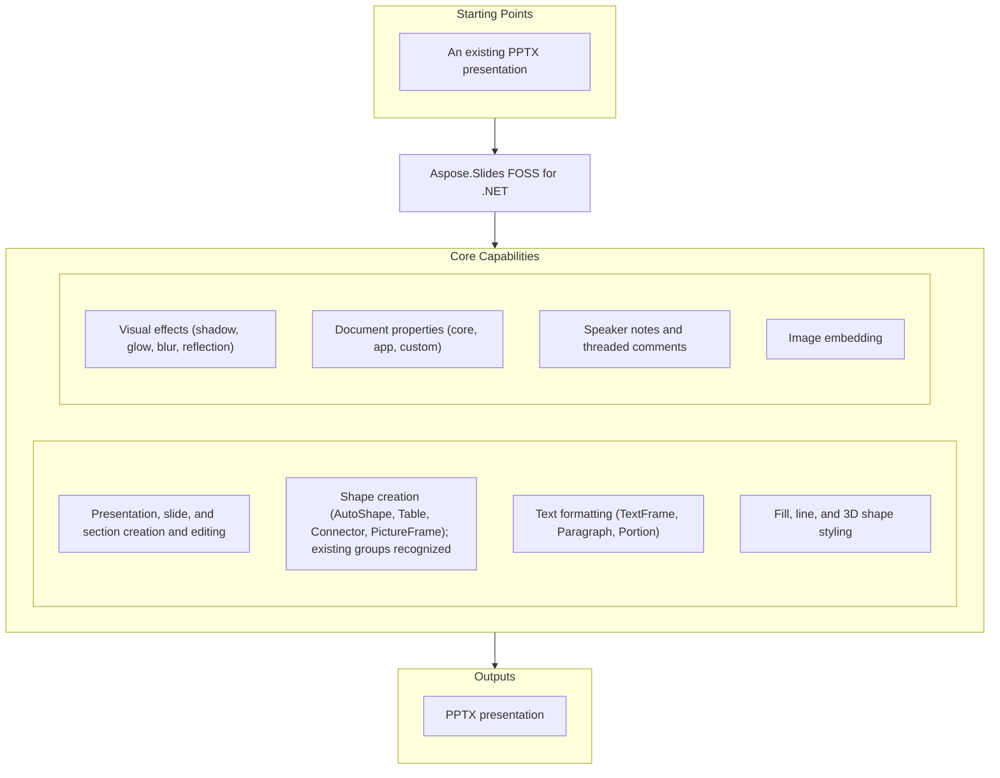

# Aspose.Slides FOSS for .NET

[](https://github.com/aspose-slides-foss/Aspose.Slides-FOSS-for-.NET/actions/workflows/ci.yml) [](LICENSE) [](src/Aspose.Slides.Foss/Aspose.Slides.Foss.csproj)

[](https://products.aspose.org/slides/net/)

Aspose.Slides FOSS for .NET is a free, open-source .NET library for creating, reading, and
editing PowerPoint `.pptx` presentations. It targets `net9.0`, ships with no third-party package
dependencies — it implements its own minimal OPC/ZIP container and XML parser internally — and
exposes a broad set of presentation-editing features covering slides, shapes, text, styling, and
document metadata.

## Navigation

- [At a Glance](#at-a-glance)
- [Key Capabilities](#key-capabilities)
- [Installation](#installation)
- [Quick Start](#quick-start)
- [Additional Examples](#additional-examples)
- [API Reference](#api-reference)
- [Documentation & Resources](#documentation--resources)
- [Scope and Limitations](#scope-and-limitations)
- [Development and Testing](#development-and-testing)
- [License](#license)

## At a Glance



## Key Capabilities

- Open an existing `.pptx` file or create a new `Presentation` from scratch, then save it back to
  `.pptx` — unknown XML parts encountered on load are preserved verbatim, so round-tripping a file
  never strips content this library doesn't yet recognize.
- Manage slides through `SlideCollection` — add, remove, clone, and iterate slides — or
  organize them into `Section` groups via `SectionCollection`.
- Add shapes — AutoShapes, PictureFrames, Tables, and Connectors — through
  `ShapeCollection.AddAutoShape()`, `AddPictureFrame()`, `AddTable()`, and `AddConnector()`;
  shapes already grouped in a loaded file are recognized as `GroupShape`, though groups cannot be
  created or modified programmatically.
- Style text through `TextFrame`, `Paragraph`, and `Portion` — character-level formatting via
  `PortionFormat` and `BulletFormat`; paragraph alignment, spacing, indentation, and margins via
  `Paragraph.ParagraphFormat`; and text-frame margins, wrap, anchoring, columns, and autofit via
  `TextFrame.TextFrameFormat`.
- Style shapes with `FillFormat` — solid, gradient, pattern, and picture fills — and `LineFormat`
  for line width, dash style, arrows, join, and alignment.
- Apply visual effects through `EffectFormat` — outer shadow, glow, soft edge, blur, reflection,
  and inner shadow.
- Configure 3D bevel, camera, light rig, material, and extrusion depth through `ThreeDFormat`.
- Read and write core, app, and custom document properties through `DocumentProperties`,
  including `SetCustomPropertyValue()`.
- Attach per-slide speaker notes with header/footer management via
  `NotesSlideManager.AddNotesSlide()`, and threaded review comments with authors, timestamps, and
  positions via `CommentAuthorCollection.AddAuthor()` and `CommentCollection.AddComment()`.
- Embed images from a file, bytes, or stream through `Presentation.Images.AddImage()`, and
  reference them from `PictureFrame` shapes.

## Installation

A NuGet package for `Aspose.Slides.Foss` has not been published yet. Install it from a source
checkout instead (requires the [.NET 9.0 SDK](https://dotnet.microsoft.com/download)):

```bash
git clone https://github.com/aspose-slides-foss/Aspose.Slides-FOSS-for-.NET.git
cd Aspose.Slides-FOSS-for-.NET
dotnet build
```

Reference the library project directly from your own `.csproj`:

```xml
<ItemGroup>
  <ProjectReference Include="path/to/Aspose.Slides-FOSS-for-.NET/src/Aspose.Slides.Foss/Aspose.Slides.Foss.csproj" />
</ItemGroup>
```

The library targets `net9.0` and has no third-party package dependencies.

## Dependencies

### Required Package Dependencies

No required third-party package dependencies.

### Development Dependencies

- `xunit` and `xunit.runner.visualstudio` — the test framework and runner used by this project's
  own test suite.
- `Microsoft.NET.Test.Sdk` — the .NET test SDK required to build and run the test projects.
- `FluentAssertions` — the assertion library used in this project's own tests.
- `coverlet.collector` — the code-coverage collector used by this project's own test tooling.

## Quick Start

```csharp
using Aspose.Slides.Foss;
using Aspose.Slides.Foss.Export;

// Open an existing presentation
using var prs = new Presentation("input.pptx");
Console.WriteLine($"Slides: {prs.Slides.Count}");
prs.Save("output.pptx", SaveFormat.Pptx);

// Create a new presentation
using var newPrs = new Presentation();
var slide = newPrs.Slides[0];
newPrs.Save("new.pptx", SaveFormat.Pptx);
```

## Additional Examples

One runnable snippet per feature area:

### Shapes

```csharp
using Aspose.Slides.Foss;
using Aspose.Slides.Foss.Export;

using var prs = new Presentation();
var slide = prs.Slides[0];
var shape = slide.Shapes.AddAutoShape(ShapeType.Rectangle, 50, 50, 300, 100);
shape.AddTextFrame("Hello, world!");
prs.Save("shapes.pptx", SaveFormat.Pptx);
```

<details>
<summary>View Additional Examples</summary>

### Text Formatting

```csharp
using Aspose.Slides.Foss;
using Aspose.Slides.Foss.Drawing;
using Aspose.Slides.Foss.Export;

using var prs = new Presentation();
var shape = prs.Slides[0].Shapes.AddAutoShape(ShapeType.Rectangle, 50, 50, 400, 150);
var tf = shape.AddTextFrame("Formatted text");
var fmt = tf.Paragraphs[0].Portions[0].PortionFormat;
fmt.FontHeight = 24;
fmt.FontBold = NullableBool.True;
fmt.FillFormat.FillType = FillType.Solid;
fmt.FillFormat.SolidFillColor.Color = Color.FromArgb(255, 0, 70, 127);
prs.Save("text.pptx", SaveFormat.Pptx);
```

### Table

```csharp
using Aspose.Slides.Foss;
using Aspose.Slides.Foss.Export;

using var prs = new Presentation();
var table = prs.Slides[0].Shapes.AddTable(50, 50, [120.0, 120.0, 120.0], [40.0, 40.0]);
table.Rows[0][0].TextFrame.Text = "Name";
table.Rows[0][1].TextFrame.Text = "Value";
prs.Save("table.pptx", SaveFormat.Pptx);
```

### Connector

```csharp
using Aspose.Slides.Foss;
using Aspose.Slides.Foss.Export;

using var prs = new Presentation();
var slide = prs.Slides[0];
var box1 = slide.Shapes.AddAutoShape(ShapeType.Rectangle, 50, 100, 150, 60);
var box2 = slide.Shapes.AddAutoShape(ShapeType.Rectangle, 350, 100, 150, 60);
var conn = slide.Shapes.AddConnector(ShapeType.BentConnector3, 0, 0, 10, 10);
conn.StartShapeConnectedTo = box1;
conn.StartShapeConnectionSiteIndex = 3;  // right
conn.EndShapeConnectedTo = box2;
conn.EndShapeConnectionSiteIndex = 1;    // left
prs.Save("connector.pptx", SaveFormat.Pptx);
```

### Fill

```csharp
using Aspose.Slides.Foss;
using Aspose.Slides.Foss.Drawing;
using Aspose.Slides.Foss.Export;

using var prs = new Presentation();
var shape = prs.Slides[0].Shapes.AddAutoShape(ShapeType.Rectangle, 50, 50, 300, 150);
shape.FillFormat.FillType = FillType.Solid;
shape.FillFormat.SolidFillColor.Color = Color.FromArgb(255, 30, 120, 200);
prs.Save("fill.pptx", SaveFormat.Pptx);
```

### Notes

```csharp
using Aspose.Slides.Foss;
using Aspose.Slides.Foss.Export;

using var prs = new Presentation();
var notes = prs.Slides[0].NotesSlideManager.AddNotesSlide();
notes.NotesTextFrame.Text = "Speaker notes go here.";
prs.Save("notes.pptx", SaveFormat.Pptx);
```

### Comments

```csharp
using Aspose.Slides.Foss;
using Aspose.Slides.Foss.Drawing;
using Aspose.Slides.Foss.Export;

using var prs = new Presentation();
var author = prs.CommentAuthors.AddAuthor("Jane Smith", "JS");
var slide = prs.Slides[0];
author.Comments.AddComment("Review this slide", slide, new PointF(2.0f, 2.0f), DateTime.Now);
prs.Save("comments.pptx", SaveFormat.Pptx);
```

### Document Properties

```csharp
using Aspose.Slides.Foss;
using Aspose.Slides.Foss.Export;

using var prs = new Presentation();
prs.DocumentProperties.Title = "Q1 Results";
prs.DocumentProperties.Author = "Finance Team";
prs.DocumentProperties.SetCustomPropertyValue("Version", 3);
prs.Save("deck.pptx", SaveFormat.Pptx);
```

</details>

## API Reference

The primary entry point is `Presentation`, which owns a `SlideCollection` of `Slide` objects; each
`Slide` exposes its shapes through `Slide.Shapes` (a `ShapeCollection`).

<details>
<summary>View the Core API Surface</summary>

### Aspose.Slides.Foss

| Class | Description |
|---|---|
| `AdjustValue` | Represents a geometry shape adjustment value backed by an XML guide definition element. |
| `AdjustValueCollection` | Represents a collection of shape's adjustment values. |
| `AutoShape` | Represents an AutoShape — a preset or custom geometric shape that may contain text. |
| `BaseHandoutNotesSlideHeaderFooterManager` | Represents the base class for handout and notes slide header/footer managers. |
| `BasePortionFormat` | Common text-run formatting properties backed by an OOXML &lt;a:rPr&gt; element. |
| `BaseShapeLock` | Represents the base class for locks that determine which operations are disabled on a shape. |
| `BaseSlide` | Base class for Slide, LayoutSlide, and MasterSlide providing common slide functionality. |
| `Blur` | Represents a blur effect that is applied to the entire shape, including its fill. |
| `BulletFormat` | Manages paragraph bullet formatting backed by OOXML bullet elements. |
| `Camera` | Represents 3D camera properties for a shape. |
| `Cell` | Represents a single cell within a table in a PowerPoint presentation. |
| `CellCollection` | Represents a read-only collection of table cells associated with a parent slide and slide part. |
| `CellFormat` | Represents the formatting properties of a table cell, providing access to fill formatting and six border line formats (left, top, right, bottom, diagonal-down, diagonal-up). |
| `Color` | Immutable value type representing an ARGB color. |
| `ColorFormat` | Represents a color format used in presentation elements. |
| `Column` | Represents a table column as a collection of cells (one per row). |
| `ColumnCollection` | Represents a collection of columns in a table. |
| `ColumnFormat` | Represents the formatting properties of a table column. |
| `Comment` | Represents a comment on a slide. |
| `CommentAuthor` | Represents an author of comments in a presentation. |
| `CommentAuthorCollection` | Represents a collection of comment authors backed by a CommentAuthorsPart. |
| `CommentCollection` | Represents a collection of comments authored by a single author across all slides in a presentation. |
| `Connector` | Represents a connector shape that can link two shapes via connection sites. |
| `ConnectorLock` | Determines which operations are disabled on the parent connector shape. |
| `CustomData` | Represents custom data associated with a shape. |
| `DocumentProperties` | Represents the metadata properties of a presentation, wrapping OPC core, app, and custom property parts with lazy initialization. |
| `EffectFormat` | Represents effect formatting properties backed by an effectLst element. |
| `FillFormat` | Represents fill formatting options. |
| `FillOverlay` | Represents a Fill Overlay effect. |
| `FontData` | Represents a font definition with a typeface name. |
| `GeometryShape` | Represents the base class for shapes that have geometric properties. |
| `GlobalLayoutSlideCollection` | Aggregates all layout slides across all master slides in a presentation. |
| `Glow` | Represents a glow effect, in which a color blurred outline is added outside the edges of the object. |
| `GradientFormat` | Represents a gradient format. |
| `GradientStop` | Represents a single gradient stop within a gradient fill. |
| `GradientStopCollection` | Manages a collection of &lt;a:gs&gt; child elements within an &lt;a:gsLst&gt; XML element. |
| `GraphicalObject` | Abstract base class for graphical objects on a slide. |
| `GraphicalObjectLock` | Represents a lock that determines which operations are disabled on a graphical object. |
| `GroupShape` | Represents a group shape that contains a collection of shapes. |
| `HeadingPair` | Represents a 'Heading pair' property of the document. |
| `IImage` | Represents a raster or vector image. |
| `IImageCollection` | Represents a collection of IPPImage objects. |
| `IPPImage` | Represents a presentation-embedded image stored in an OPC package part. |
| `IParagraph` | Represents a paragraph of text. |
| `IPortion` | Represents a portion (run) of text inside a paragraph. |
| `IPresentation` | Represents a presentation document. |
| `IPresentationComponent` | Represents any component that belongs to a presentation. |
| `ISlideComponent` | Represents any component that belongs to a slide. |
| `ISlidesPicture` | Represents a picture reference within a slide. |
| `IThemeable` | Represents objects that can be themed. |
| `Image` | Concrete image wrapper holding raw bytes and metadata. |
| `ImageCollection` | Concrete collection managing presentation images within an OPC package. |
| `ImageTransformOperation` | Represents an image transform operation effect. |
| `Images` | Provides static factory methods for creating Image instances. |
| `InnerShadow` | Represents an inner shadow effect. |
| `LayoutSlide` | Represents a layout slide in a presentation. |
| `LayoutSlideCollection` | Base class for collections of layout slides. |
| `LightRig` | Represents a light rig. |
| `LineFillFormat` | Represents properties for lines filling. |
| `LineFormat` | Represents line formatting properties. |
| `LoadOptions` | Represents options that can be used to control how a presentation is loaded. |
| `MasterLayoutSlideCollection` | Represents a collections of all layout slides of defined master slide. |
| `MasterSlide` | Represents a master slide in a presentation. |
| `MasterSlideCollection` | Represents a collection of master slides in a presentation. |
| `NotesSize` | Represents the size of a notes slide. |
| `NotesSlide` | Represents a notes slide in a presentation. |
| `NotesSlideHeaderFooterManager` | Manages visibility and text content of header, footer, date-time, and slide number placeholders on a notes slide. |
| `NotesSlideManager` | Manages notes slide operations for a slide. |
| `OuterShadow` | Represents an outer shadow effect. |
| `PPImage` | Concrete presentation-embedded image backed by an OPC package part. |
| `PVIObject` | Concrete base class providing property-value-inheritance infrastructure. |
| `Paragraph` | Represents a paragraph of text. |
| `ParagraphCollection` | Represents a collection of paragraphs. |
| `ParagraphFormat` | Represents the formatting properties for a paragraph. |
| `PatternFormat` | Represents a pattern fill format. |
| `Picture` | Concrete picture reference backed by an a:blip XML element in a slide's XML. |
| `PictureFillFormat` | Represents a picture fill style. |
| `PictureFrame` | Represents a picture frame shape. |
| `PictureFrameLock` | Determines which operations are disabled on the parent picture frame. |
| `Placeholder` | Represents a placeholder on a slide. |
| `PointF` | Represents a 2D point with float coordinates. |
| `Portion` | Represents a portion (run) of text inside a text paragraph. |
| `PortionCollection` | Represents a mutable collection of portions belonging to a slide component. |
| `PortionFormat` | This class contains the text portion formatting properties. |
| `Presentation` | Represents a Microsoft PowerPoint presentation document. |
| `PresetShadow` | Represents a preset shadow effect. |
| `Reflection` | Represents a reflection effect. |
| `Row` | Represents a table row as a collection of cells. |
| `RowCollection` | Represents a collection of rows in a table. |
| `RowFormat` | Represents the formatting properties of a table row. |
| `SaveOptions` | Represents options that control how a presentation is saved. |
| `Section` | Represents a section of slides in a presentation. |
| `SectionCollection` | Represents a collection of sections in a presentation. |
| `Shape` | Base class for all shapes on a slide. |
| `ShapeBevel` | Represents the bevel (relief) properties of a shape's face. |
| `ShapeCollection` | Represents an ordered, mutable collection of IShape objects belonging to a slide or group shape. |
| `ShapeFrame` | Represents the geometric frame properties of a shape. |
| `ShapeStyle` | Represents a shape's style reference. |
| `Size` | Represents a 2D size with integer dimensions. |
| `SizeF` | Represents a 2D size with float dimensions. |
| `Slide` | Represents a slide in a presentation. |
| `SlideCollection` | Represents a collection of slides in a presentation. |
| `SoftEdge` | Represents a soft edge effect. |
| `Table` | Represents a table shape on a slide. |
| `TableFormat` | Represents format of a table. |
| `TextFrame` | Represents the text body of a shape. |
| `TextFrameFormat` | Contains the TextFrame's formatting properties. |
| `ThreeDFormat` | Represents 3-D formatting properties for a shape. |

#### Interfaces

| Interface | Description |
|---|---|
| `IAdjustValue` | Represents a single adjustment value for a geometry shape. |
| `IAdjustValueCollection` | Represents a collection of shape adjustment values. |
| `IAutoShape` | Represents an AutoShape. |
| `IBaseHandoutNotesSlideHeaderFooterManager` | Represents a base interface for handout and notes slide header and footer management. |
| `IBaseHeaderFooterManager` | Represents a base interface for header and footer management. |
| `IBasePortionFormat` | Defines common text run formatting properties. |
| `IBaseSlide` | Represents a base slide. |
| `IBaseSlideHeaderFooterManager` | Represents a base interface for slide-level header and footer management. |
| `IBlur` | Represents a blur effect that is applied to the entire shape, including its fill. |
| `IBulkTextFormattable` | Represents an object that can apply text formatting in bulk to all contained text. |
| `IBulletFormat` | Represents paragraph bullet formatting properties. |
| `ICamera` | Represents the 3-D camera properties for a shape. |
| `ICell` | Represents a single cell in a table. |
| `ICellCollection` | Represents a collection of table cells. |
| `ICellFormat` | Represents the formatting of a table cell. |
| `IColorFormat` | Represents a color format used in presentation elements. |
| `IColumn` | Represents a single column in a table. |
| `IColumnCollection` | Represents a collection of table columns. |
| `IColumnFormat` | Represents the formatting properties of a table column. |
| `IComment` | Represents a comment on a slide. |
| `ICommentAuthor` | Represents an author of comments. |
| `ICommentAuthorCollection` | Represents a collection of comment authors. |
| `ICommentCollection` | Represents a collection of comments. |
| `IConnector` | Represents a connector shape that links two shapes. |
| `IConnectorLock` | Determines which operations are disabled on the parent connector shape. |
| `ICustomData` | Represents custom data associated with a shape. |
| `IDocumentProperties` | Represents the metadata properties of a presentation document. |
| `IEffectFormat` | Represents visual effect formatting properties for a shape. |
| `IEffectParamSource` | Represents a source of effect parameters. |
| `IFillFormat` | Represents fill formatting properties for a shape or text. |
| `IFillOverlay` | Represents a Fill Overlay effect. |
| `IFillParamSource` | Auxiliary interface for fill parameter source. |
| `IFontData` | Represents a font definition. |
| `IGeometryShape` | Represents a shape with geometric properties. |
| `IGlobalLayoutSlideCollection` | Represents a collection of all layout slides in presentation. |
| `IGlow` | Represents a glow effect, in which a color blurred outline is added outside the edges of the object. |
| `IGradientFormat` | Represents gradient fill formatting properties. |
| `IGradientStop` | Represents a single stop in a gradient fill. |
| `IGradientStopCollection` | Represents a collection of gradient stops. |
| `IGraphicalObject` | Represents a graphical object on a slide. |
| `IGraphicalObjectLock` | Determines which operations are disabled on the parent graphical object. |
| `IGroupShape` | Represents a group shape that contains other shapes. |
| `IHeadingPair` | Represents a heading pair entry describing a content grouping in a presentation. |
| `IHyperlinkContainer` | Represents an object that can contain hyperlinks. |
| `IImageTransformOperation` | Represents an image transform operation effect. |
| `IInnerShadow` | Represents an inner shadow effect. |
| `ILayoutSlide` | Represents a layout slide. |
| `ILayoutSlideCollection` | Represents a base class for collection of layout slides. |
| `ILightRig` | Represents a light rig. |
| `ILineFillFormat` | Represents properties for lines filling. |
| `ILineFormat` | Represents format of a line. |
| `ILineParamSource` | Marker interface for objects that can serve as a source of line parameters. |
| `ILoadOptions` | Represents options that can be used to control how a presentation is loaded. |
| `IMasterLayoutSlideCollection` | Represents a collection of layout slides belonging to a master slide. |
| `IMasterSlide` | Represents a master slide in a presentation. |
| `IMasterSlideCollection` | Represents a collection of master slides. |
| `INotesSize` | Represents the size of a notes slide. |
| `INotesSlide` | Represents a notes slide in a presentation. |
| `INotesSlideHeaderFooterManager` | Represents a manager for notes slide header and footer placeholders. |
| `INotesSlideManager` | Manages notes slide operations for a slide. |
| `IOuterShadow` | Represents an Outer Shadow effect. |
| `IParagraphCollection` | Represents a collection of paragraphs. |
| `IParagraphFormat` | Contains the paragraph formatting properties. |
| `IPatternFormat` | Represents a pattern fill format. |
| `IPictureFillFormat` | Represents a picture fill style. |
| `IPictureFrame` | Represents a picture frame shape. |
| `IPictureFrameLock` | Determines which editing operations are disabled on a picture frame. |
| `IPlaceholder` | Represents a placeholder on a slide. |
| `IPortionCollection` | Represents a collection of portions. |
| `IPortionFormat` | Defines the formatting properties for a text portion, combining base portion formatting with hyperlink container capabilities. |
| `IPresetShadow` | Represents a Preset Shadow effect. |
| `IReflection` | Represents a reflection effect. |
| `IRow` | Represents a row in a table. |
| `IRowCollection` | Represents a collection of table rows. |
| `IRowFormat` | Represents the formatting properties for a table row. |
| `ISaveOptions` | Represents options that control how a presentation is saved. |
| `ISection` | Represents a section of slides in a presentation. |
| `ISectionCollection` | Represents a collection of sections in a presentation. |
| `IShape` | Represents a shape on a slide. |
| `IShapeBevel` | Represents the bevel (relief) properties of a shape's face. |
| `IShapeCollection` | Represents an ordered, mutable collection of IShape objects belonging to a slide or group shape. |
| `IShapeFrame` | Represents the geometric frame properties of a shape. |
| `IShapeStyle` | Represents a shape's style reference. |
| `ISlide` | Represents a slide in a presentation. |
| `ISlideCollection` | Represents a collection of slides in a presentation. |
| `ISoftEdge` | Represents a Soft Edge effect. |
| `ITable` | Represents a table on a slide. |
| `ITableFormat` | Represents format of a table. |
| `ITextFrame` | Represents the text frame of a shape or cell. |
| `ITextFrameFormat` | Contains the TextFrame's formatting properties. |
| `IThreeDFormat` | Represents 3-D properties. |
| `IThreeDParamSource` | Marker interface for objects that provide 3D formatting parameters. |

#### Enumerations

| Enumeration | Description |
|---|---|
| `BevelPresetType` | Represents BevelPresetType enumeration. |
| `BulletType` | Represents BulletType enumeration. |
| `CameraPresetType` | Represents CameraPresetType enumeration. |
| `ColorType` | Represents ColorType enumeration. |
| `FillBlendMode` | Represents FillBlendMode enumeration. |
| `FillType` | Represents FillType enumeration. |
| `FontAlignment` | Represents FontAlignment enumeration. |
| `GradientDirection` | Represents GradientDirection enumeration. |
| `GradientShape` | Represents GradientShape enumeration. |
| `LightRigPresetType` | Represents LightRigPresetType enumeration. |
| `LightingDirection` | Represents LightingDirection enumeration. |
| `LineAlignment` | Represents LineAlignment enumeration. |
| `LineArrowheadLength` | Represents LineArrowheadLength enumeration. |
| `LineArrowheadStyle` | Represents LineArrowheadStyle enumeration. |
| `LineArrowheadWidth` | Represents LineArrowheadWidth enumeration. |
| `LineCapStyle` | Represents LineCapStyle enumeration. |
| `LineDashStyle` | Represents LineDashStyle enumeration. |
| `LineJoinStyle` | Represents LineJoinStyle enumeration. |
| `LineStyle` | Represents LineStyle enumeration. |
| `MaterialPresetType` | Represents MaterialPresetType enumeration. |
| `NullableBool` | Represents NullableBool enumeration. |
| `NumberedBulletStyle` | Represents NumberedBulletStyle enumeration. |
| `PatternStyle` | Represents PatternStyle enumeration. |
| `PictureFillMode` | Represents PictureFillMode enumeration. |
| `PresetColor` | Represents PresetColor enumeration. |
| `PresetShadowType` | Represents PresetShadowType enumeration. |
| `RectangleAlignment` | Represents RectangleAlignment enumeration. |
| `SaveFormat` | Defines constants representing all supported file formats for saving a presentation. |
| `SchemeColor` | Represents SchemeColor enumeration. |
| `ShapeType` | Represents preset geometry of geometry shapes. |
| `SlideLayoutType` | Represents SlideLayoutType enumeration. |
| `SourceFormat` | Represents SourceFormat enumeration. |
| `TableStylePreset` | Represents TableStylePreset enumeration. |
| `TextAlignment` | Represents TextAlignment enumeration. |
| `TextAnchorType` | Represents TextAnchorType enumeration. |
| `TextAutofitType` | Represents TextAutofitType enumeration. |
| `TextCapType` | Represents TextCapType enumeration. |
| `TextShapeType` | Represents TextShapeType enumeration. |
| `TextStrikethroughType` | Represents TextStrikethroughType enumeration. |
| `TextUnderlineType` | Represents TextUnderlineType enumeration. |
| `TextVerticalType` | Represents TextVerticalType enumeration. |
| `TileFlip` | Represents TileFlip enumeration. |

---

#### Detailed Member Reference

### Presentation and Slides

- `Presentation`
  - `Slides -> SlideCollection`
  - `LayoutSlides -> LayoutSlideCollection`
  - `Masters -> MasterSlideCollection`
  - `DocumentProperties -> DocumentProperties`
  - `CommentAuthors -> CommentAuthorCollection`
  - `Save(fileName, format)` / `Save(stream, format)`
- `SlideCollection`
  - `AddEmptySlide(layout) -> Slide`
  - `AddClone(slide) -> Slide`
  - `RemoveAt(index)`
- `Slide`
  - `Shapes -> ShapeCollection`
  - `NotesSlideManager -> NotesSlideManager`
  - `Hidden` (bool)

### Shapes and Text

- `ShapeCollection`
  - `AddAutoShape(shapeType, x, y, width, height) -> AutoShape`
  - `AddTable(x, y, colWidths, rowHeights) -> Table`
  - `AddConnector(shapeType, x, y, width, height) -> Connector`
  - `AddPictureFrame(shapeType, x, y, width, height, image) -> PictureFrame`
- `TextFrame`
  - `Paragraphs -> ParagraphCollection`
  - `Text` (set convenience)
- `Portion`
  - `PortionFormat -> PortionFormat`
- `PortionFormat`
  - `FontHeight`, `FontBold`, `FillFormat -> FillFormat`

### Styling and Effects

- `FillFormat` — `FillType`, `SolidFillColor`
- `LineFormat` — `Width`, `DashStyle`
- `EffectFormat` — `EnableOuterShadowEffect()`, `OuterShadowEffect`
- `ThreeDFormat` — `BevelTop`

### Document Properties, Notes, and Comments

- `DocumentProperties` — `Title`, `Author`, `SetCustomPropertyValue(name, value)`
- `NotesSlideManager` — `AddNotesSlide() -> NotesSlide`
- `CommentAuthorCollection` — `AddAuthor(name, initials) -> CommentAuthor`
- `CommentAuthor` — `Comments.AddComment(text, slide, position, dateTime)`

### Images

- `Images` — `FromFile(path) -> Image`, `FromStream(stream) -> Image`
- `ImageCollection` — `AddImage(bytes) -> IPPImage`

</details>

## Documentation & Resources

See below for documentation links and support resources.

- **[Getting started guide](https://docs.aspose.org/slides/net/)** — installation, walkthroughs, and feature guides for this library.
- **[How-to guides & FAQ](https://kb.aspose.org/slides/net/)** — task-focused answers for common presentation-processing questions.
- **[Full API reference](https://reference.aspose.org/slides/net/)** — the complete, browsable reference for all 242 public types (the [API reference](#api-reference) section above covers the essentials).
- **[Source repository](https://github.com/aspose-slides-foss/Aspose.Slides-FOSS-for-.NET)** — browse the code, track releases, and review history.
- Found a bug or have a feature request? [Open an issue](https://github.com/aspose-slides-foss/Aspose.Slides-FOSS-for-.NET/issues) on GitHub.

See [AGENTS.md](AGENTS.md) in the repository root for architecture notes and conventions for contributors.

## Scope and Limitations

- The following areas are not yet implemented: charts, SmartArt, OLE objects, and mathematical text.
- Animations and slide transitions are not yet implemented.
- Non-PPTX outputs (PDF, HTML, SVG, images) are not yet implemented.
- VBA macros and digital signatures are not yet implemented.
- Hyperlinks and action settings are not yet implemented.
- Unknown XML parts encountered during load are preserved verbatim on save, so opening and
  re-saving a file never strips content this library doesn't yet understand.
- Saving currently always produces PPTX content, regardless of which output type is requested;
  only PPTX is a genuinely working save target today.

These limitations don't apply to
[Aspose.Slides for .NET — Enterprise Edition](https://products.aspose.com/slides/net/), which
adds broader export coverage (PDF, HTML, and images), chart and animation support, VBA and
digital signature handling, and full feature completeness with commercial support.

## Development and Testing

```bash
dotnet restore
dotnet build --configuration Release
dotnet test tests/Aspose.Slides.Foss.Tests --configuration Release
dotnet test tests/Aspose.Slides.Foss.IntegrationTests --configuration Release
```

Continuous integration runs the same steps on Ubuntu and Windows via GitHub Actions
([`ci.yml`](.github/workflows/ci.yml)), targeting `net9.0`.

## License

This project is licensed under the [MIT License](LICENSE). The MIT License permits use, copying,
modification, distribution, sublicensing, and commercial use, provided its copyright and
permission notice are retained. The software is provided without warranty.
